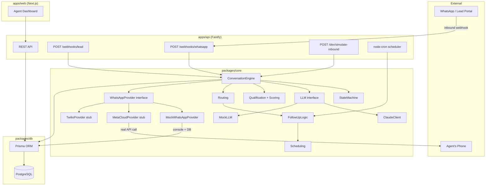
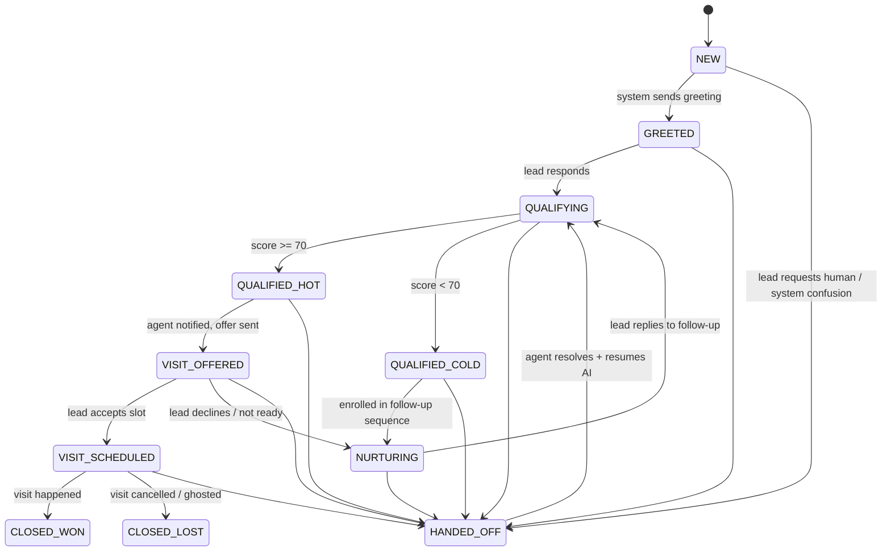
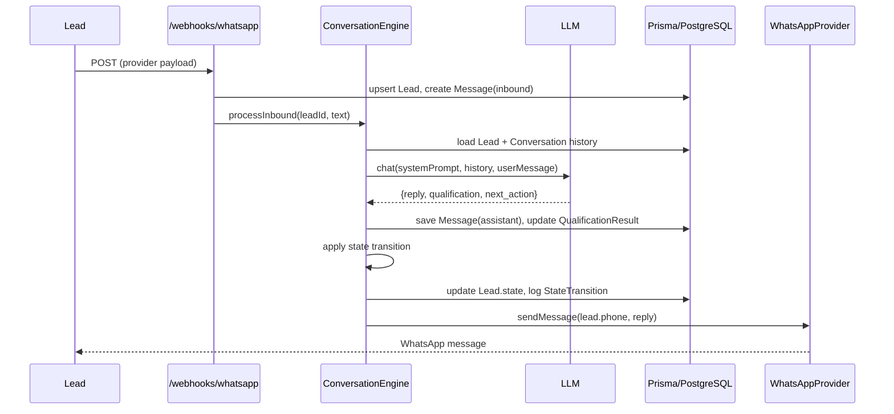

# LeadPilot — Architecture

---

## Component Diagram

---

## Module Responsibilities

| Module | Responsibility |
|--------|---------------|
| `apps/api` | Fastify server: webhook handlers, REST CRUD, cron bootstrap, demo/tick scripts |
| `apps/web` | Next.js agent dashboard: lead list, conversation timeline, site-visit schedule |
| `packages/db` | Prisma schema, client singleton, migrations, seed data |
| `packages/core/whatsapp` | `WhatsAppProvider` interface + `MockWhatsAppProvider` + typed stubs |
| `packages/core/llm` | `LLMClient` interface + `ClaudeClient` + `MockLLM` |
| `packages/core/conversation` | State machine + conversation engine (pure, side-effects injected) |
| `packages/core/qualification` | Zod schema, LLM prompt for extraction, deterministic scoring |
| `packages/core/routing` | HOT/NURTURE classification, agent notification dispatch |
| `packages/core/followups` | Nurture sequence logic, follow-up message generation |
| `packages/core/scheduling` | Site-visit slot availability, booking, confirmation |

---

## Conversation State Machine

---

## WhatsApp 24-Hour Window

WhatsApp Business policy (and the India DPDP Act) require that business-initiated messages outside the 24-hour customer-care window use approved Message Templates — not free-form text.

LeadPilot tracks `last_inbound_at` on the `Lead` record. The active `WhatsAppProvider` checks this timestamp before sending any proactive message:

- **Inside 24h**: free-form message sent normally.
- **Outside 24h (Mock provider)**: logs a `WARN` to console — `[WhatsApp] Sending outside 24h window — real provider would require a template here`. The message is still delivered in mock mode so the demo flow works.
- **Outside 24h (Meta/Twilio providers)**: must use `sendTemplate()` with an approved template. The stubs enforce this at the type level.

This design means the 24h constraint is visible in dev without preventing local testing.

---

## Data Flow — Inbound Lead

---

## Assumptions

See `docs/DECISIONS.md` for full ADRs.
